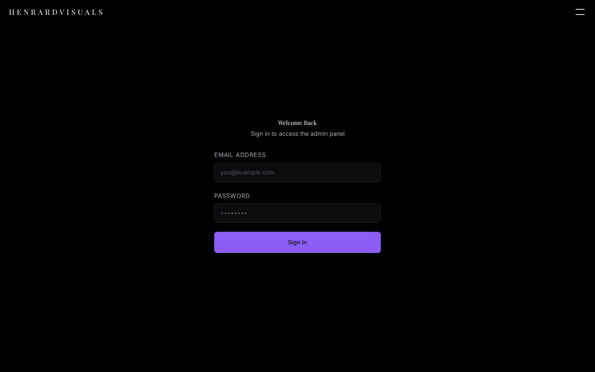

# HenrardVisuals

[](https://github.com/K-Schmitt/HenrardVisuals/actions/workflows/ci.yml)

**Professional photography portfolio** built with React 18, TypeScript, Supabase, and Docker.

[](LICENSE)
[](https://www.typescriptlang.org/)
[](https://react.dev/)
[](https://supabase.com/)
[](https://www.docker.com/)

**Live demo:** [henrardvisuals.com](https://henrardvisuals.com)

| Home | Gallery | Admin |
|---|---|---|
|  |  |  |

---

## Overview

HenrardVisuals is a full-stack photography portfolio designed for editorial and fashion photography. It features an elegant masonry gallery, a bilingual interface (FR/EN), and a complete admin panel for managing photos, categories, and site settings — all backed by a self-hosted Supabase instance.

---

## Features

- **Masonry gallery** with category filtering and a modal lightbox (keyboard-navigable)
- **Admin panel** — upload photos, manage categories, edit profile settings, change account credentials
- **Row-Level Security** — write operations restricted to admin role via JWT app_metadata
- **Bilingual UI** — French / English with `localStorage` persistence
- **Self-hosted Supabase** — full control over auth, database, and storage
- **Docker-ready** — single `docker compose up` for local development
- **Responsive** — mobile-first layout with a custom Tailwind design system

---

## Tech Stack

| Layer | Technology |
|---|---|
| Frontend | React 18, TypeScript, Vite 5 |
| Styling | Tailwind CSS (custom design system) |
| Routing | React Router DOM v6 |
| Backend | Supabase (self-hosted) — Auth, PostgreSQL, Storage |
| Proxy | Kong API Gateway |
| Container | Docker, Docker Compose |

---

## Getting Started

### Prerequisites

- [Docker](https://docs.docker.com/get-docker/) & Docker Compose
- [Node.js](https://nodejs.org/) 20+ (for local frontend dev)
- [pnpm](https://pnpm.io/) (`npm install -g pnpm`)

### 1. Clone & configure

```bash
git clone https://github.com/K-Schmitt/HenrardVisuals.git
cd HenrardVisuals

# Generate JWT keys and copy the example env file
node generate-keys.cjs
cp .env.example .env
# Fill in the values printed by generate-keys.cjs
```

### 2. Start the stack

```bash
# Start all services (Supabase, DB, Storage, Kong, Frontend)
docker compose up -d

# Watch logs
docker compose logs -f app
```

### 3. Initialize the database

```bash
# The Compose stack applies supabase/migrations/*.sql automatically on first boot.
# Against an existing/managed Supabase, apply them in order:
for f in supabase/migrations/*.sql; do
  psql "$DATABASE_URL" -v ON_ERROR_STOP=1 -f "$f"
done
```

The storage bucket and its access policies are skipped on first boot (`storage-api` creates the schema they write to only once Postgres is already healthy). Once the full stack is up, seed them once — the second command's three "already exists" errors are expected, from policies applied during boot. The third re-applies the admin-only storage policies from `005`; it is idempotent (every `CREATE POLICY` is preceded by a matching `DROP POLICY IF EXISTS`) and can be replayed as often as needed:

```bash
psql "$DATABASE_URL" -v ON_ERROR_STOP=1 -f supabase/migrations/002_storage_bucket.sql
psql "$DATABASE_URL" -f supabase/migrations/003_rls_admin_only.sql
psql "$DATABASE_URL" -v ON_ERROR_STOP=1 -f supabase/migrations/005_rls_hardening.sql
```

### 4. Create the admin user

```bash
psql "$DATABASE_URL" \
  -v ADMIN_EMAIL='admin@example.com' \
  -v ADMIN_PASSWORD='your_secure_password' \
  -f supabase/create-admin-user.sql
```

Open [http://localhost:5173](http://localhost:5173) — admin panel at `/admin`.

---

## Usage

**As a visitor:**
- Browse photos by category on the home page
- Click any photo to open the lightbox — navigate with arrows or keyboard (`←` `→` `Esc`)
- Switch language (FR/EN) from the navigation bar, persisted in `localStorage`

**As an admin** — log in at `/admin`:
- **Photos** — upload via drag-and-drop, delete, assign to a category
- **Categories** — create, rename, reorder, delete
- **Settings** — edit profile info (name, bio, social links)
- **Account** — change your password or email address

---

## API

The backend is **PostgREST** auto-generated from the PostgreSQL schema, exposed through Kong. All reads are public; writes require an admin JWT.

| Table | Reads | Writes |
|---|---|---|
| `photos` | public | admin only (RLS) |
| `categories` | public | admin only (RLS) |
| `site_settings` | public | admin only (RLS) |

**Storage:** photos are uploaded to the `photos` bucket as `{timestamp}-{sanitized_filename}`. Public URLs are served directly from Supabase Storage.

**Auth:** JWT via GoTrue. The `ANON_KEY` is safe to ship in the frontend — RLS enforces access control, not the key itself.

Base URL: `VITE_SUPABASE_URL` (Kong gateway, default port `:8000`)

---

## Development

```bash
pnpm install        # Install dependencies
pnpm dev            # Start Vite dev server (http://localhost:5173)
pnpm type-check     # TypeScript check
pnpm lint           # ESLint
pnpm format         # Prettier
pnpm build          # Production build
```

---

## Project Structure

```
├── src/
│   ├── components/
│   │   ├── Admin/          # Panel admin (photos, categories, account, profile)
│   │   ├── Auth/           # Login form
│   │   ├── Layout/         # SiteLayout, Footer
│   │   ├── Navigation/     # BurgerMenu
│   │   ├── Upload/         # FileUpload with drag-and-drop
│   │   └── OptimizedImage  # Lazy-loaded image with Intersection Observer
│   │   └── ErrorBoundary   # Last-resort render error screen
│   ├── context/            # AuthContext, LanguageContext (FR/EN)
│   ├── hooks/              # useAuth, useHomeData, useAdminPhotos,
│   │                       # useFileUpload, useLightbox, useDocumentMeta
│   ├── i18n/               # fr.ts / en.ts + a key-parity test
│   ├── lib/                # Supabase client, typed DB helpers, image URLs
│   ├── pages/              # Home, Admin, Contact
│   └── types/              # TypeScript interfaces + Database type
├── e2e/                    # Playwright specs (no Supabase required)
├── scripts/                # audit-prod.mjs — advisories with a reviewed allowlist
├── supabase/
│   ├── migrations/         # Schema migrations (versioned SQL, single source of truth)
│   ├── tests/              # RLS regression suite (pnpm test:rls)
│   └── create-admin-user.sql  # Admin user seed (uses psql variables)
├── docs/
│   ├── ARCHITECTURE.md
│   ├── SETUP.md
│   └── DEPLOY.md
├── nginx/                  # Nginx config
├── volumes/                # Docker volume mounts (gitignored data)
├── docker-compose.yml      # Production
├── docker-compose.dev.yml  # Local development (self-hosted Supabase)
└── Dockerfile              # Multi-stage build
```

---

## Environment Variables

Copy `.env.example` to `.env` and fill in every value. Run `node generate-keys.cjs` to generate `JWT_SECRET`, `ANON_KEY`, and `SERVICE_ROLE_KEY`.

| Variable | Description |
|---|---|
| `POSTGRES_PASSWORD` | PostgreSQL password |
| `JWT_SECRET` | JWT signing secret (≥ 32 chars) |
| `ANON_KEY` | Supabase anon JWT (derived from JWT_SECRET) |
| `SERVICE_ROLE_KEY` | Supabase service-role JWT |
| `VITE_SUPABASE_URL` | Supabase API URL (Kong gateway) |
| `VITE_SUPABASE_ANON_KEY` | Same as `ANON_KEY` |
| `AUTHENTICATOR_PASSWORD` | Password for the non-superuser role PostgREST connects as |
| `DISABLE_SIGNUP` | Set `true` in production |
| `ENABLE_EMAIL_AUTOCONFIRM` | Leave `false` in production; `true` skips address verification |
| `VITE_IMAGE_TRANSFORM` | `true` only where Storage runs with imgproxy — see below |

---

## Security

- **RLS** — all write operations (photos, categories, site_settings, storage) are gated by `public.is_admin()`, which verifies `app_metadata.role = "admin"` in the JWT, with `FORCE ROW LEVEL SECURITY` on every table
- **Non-superuser API role** — PostgREST connects as `authenticator`, which owns nothing and can only assume `anon`, `authenticated` or `service_role`. On a superuser connection its `SET LOCAL ROLE` would succeed for *any* role and walk through every policy
- **Signup disabled** — `DISABLE_SIGNUP` defaults to `true` in `docker-compose.yml`; an unset variable used to read as `false`
- **Security headers** — CSP, HSTS, `X-Frame-Options`, `X-Content-Type-Options`, `Referrer-Policy` and `Permissions-Policy` are emitted from every nginx location block, and CI fails if a response arrives without all six
- **Rate limiting** — Kong meters `/auth/v1` at 20 requests per minute per IP
- **Credentials** — see [SECURITY.md](SECURITY.md) for the rotation runbook, the dependency policy, and a frank account of what leaked in this repository's history

---

## Documentation

| Document | Description |
|---|---|
| [ARCHITECTURE.md](docs/ARCHITECTURE.md) | System architecture & data flow |
| [SETUP.md](docs/SETUP.md) | Developer setup guide & testing |
| [DEPLOY.md](docs/DEPLOY.md) | VPS / Coolify deployment guide |
| [CONTRIBUTING.md](CONTRIBUTING.md) | Local setup, checks to run, commit and migration conventions |
| [SECURITY.md](SECURITY.md) | Reporting, credential rotation, dependency policy |
| [OPERATOR-ACTIONS.md](OPERATOR-ACTIONS.md) | Steps that must be run by hand against production |

---

## Known limitations

- **No server-side rendering.** Content is fetched client-side, so crawlers
  that do not execute JavaScript see an empty shell. `useDocumentMeta` fixes
  the tab title, the bookmark and the screen-reader announcement, but
  prerendering `/` and `/contact` is the natural next step.
- **Draft photos are protected by unguessable URLs, not by access control.**
  The storage bucket is public so images stay CDN-cacheable; upload paths
  carry 128 bits of entropy. A private bucket with signed URLs would be
  stricter, at the cost of that caching.
- **Image transforms are opt-in.** `VITE_IMAGE_TRANSFORM=true` serves
  width-capped variants through imgproxy — on this dataset, 1.4 MB drops to
  19 kB for a gallery tile. Where imgproxy is unavailable the app falls back
  to the original file: correct, just heavier.
- **Gzip only.** `nginx:alpine` ships without `ngx_brotli`; adding Brotli
  would require building a custom nginx image.
- **Coverage is 50/35/40/50.** The page components are untested; the hooks,
  contexts and library code are where the suite concentrates.

---

## License

[MIT](LICENSE)
