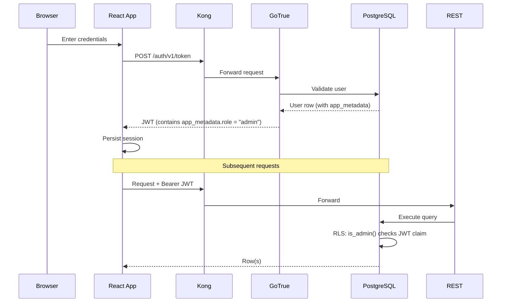
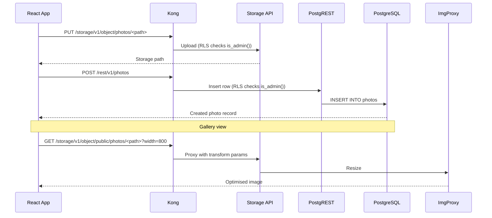
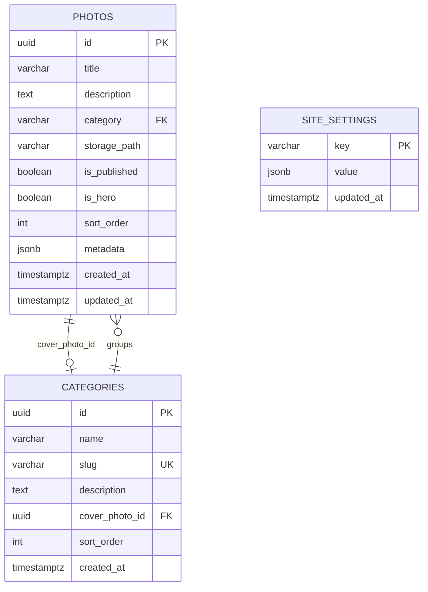

# Architecture — HenrardVisuals

## Overview

HenrardVisuals is a containerised photography portfolio built with **React/Vite/TypeScript** and a **self-hosted Supabase** stack (PostgreSQL, GoTrue auth, PostgREST, Storage API, Kong API Gateway).

---

## System Architecture

```mermaid
graph TB
    subgraph "Client"
        BROWSER((Browser))
    end

    subgraph "VPS — Docker Host"
        subgraph "Reverse Proxy"
            PROXY["Caddy / Nginx<br/>SSL Termination"]
        end

        subgraph "Application"
            APP["React App (Vite)<br/>:80"]
        end

        subgraph "Supabase Self-Hosted"
            KONG["Kong API Gateway<br/>:8000"]

            subgraph "Core Services"
                AUTH["GoTrue (Auth)<br/>:9999"]
                REST["PostgREST (API)<br/>:3000"]
                STORAGE["Storage API<br/>:5000"]
            end

            subgraph "Data"
                POSTGRES[("PostgreSQL 15<br/>photos · categories<br/>site_settings · auth")]
                IMGPROXY["ImgProxy<br/>:8080"]
            end
        end
    end

    BROWSER --> PROXY
    PROXY --> APP
    PROXY --> KONG

    KONG --> AUTH
    KONG --> REST
    KONG --> STORAGE

    APP -- "Supabase JS SDK" --> KONG

    AUTH --> POSTGRES
    REST --> POSTGRES
    STORAGE --> POSTGRES
    STORAGE --> IMGPROXY
```



---

## Authentication & Authorization Flow



### Admin Role

The `is_admin()` Postgres function reads `app_metadata.role` from the JWT — set to `"admin"` when the user is created via `supabase/create-admin-user.sql`. No row-level ownership is needed because there is exactly one admin user.

---

## Photo Upload Flow



---

## Database Schema



---

## Container Map

| Container | Image | Port(s) | Purpose |
|---|---|---|---|
| `henrard-app` | Custom (Vite prod build) | 80 | React SPA |
| `henrard-db` | postgres:15-alpine | 5432 (internal) | PostgreSQL |
| `henrard-kong` | kong:2.8 | 8000 | API Gateway |
| `henrard-auth` | supabase/gotrue | 9999 (internal) | Auth / JWT |
| `henrard-rest` | postgrest/postgrest | 3000 (internal) | REST API |
| `henrard-storage` | supabase/storage-api | 5000 (internal) | File storage |
| `henrard-meta` | supabase/postgres-meta | 8080 (internal) | DB introspection |
| `henrard-imgproxy` | darthsim/imgproxy | 8080 (internal) | Image transforms |

---

## Security Model

| Layer | Mechanism |
|---|---|
| Auth | GoTrue JWT (HS256), 1h expiry, auto-refresh |
| Database | RLS enabled on all tables; writes gated by `public.is_admin()` |
| Storage | Upload/update/delete policies call `public.is_admin()` |
| Network | All services on isolated `henrard-network`; DB not exposed externally |
| Signup | Disabled in production (`DISABLE_SIGNUP=true`) |

---

## Frontend Structure

```
src/
├── components/
│   ├── Admin/          # AccountSettings, CategoryManager, ProfileSettings
│   ├── Auth/           # Login
│   ├── Layout/         # SiteLayout, Footer
│   ├── Navigation/     # BurgerMenu
│   ├── Upload/         # FileUpload (drag-and-drop → Supabase Storage)
│   └── OptimizedImage  # Lazy-loaded image (Intersection Observer)
├── context/            # LanguageContext (FR/EN, localStorage)
├── hooks/              # useAuth
├── lib/                # supabase.ts — typed client + DB helpers
├── pages/              # Home, Admin, Contact
└── types/              # TypeScript interfaces + Database type
```
