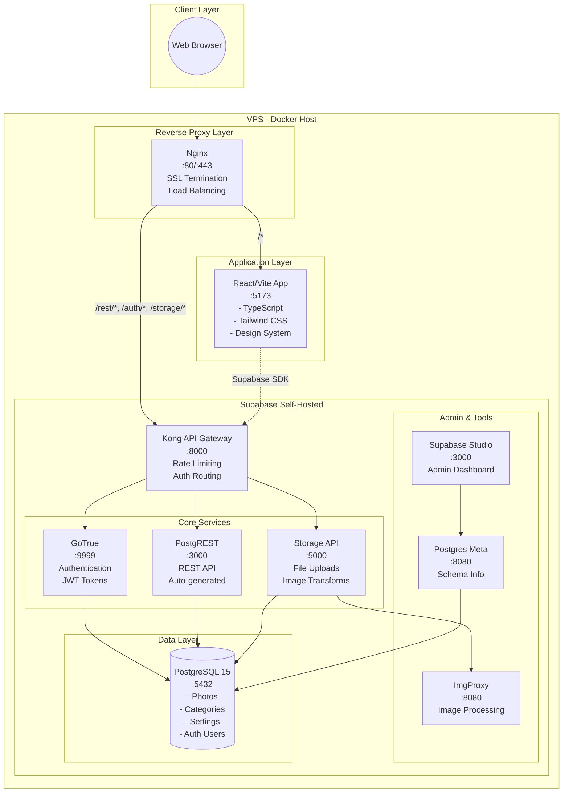
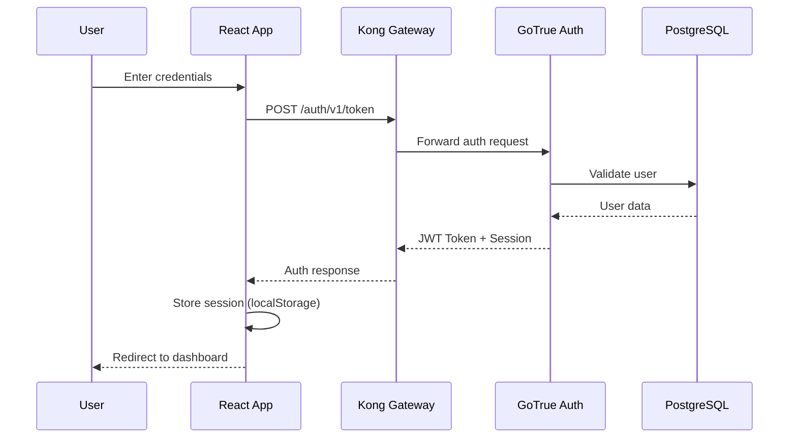
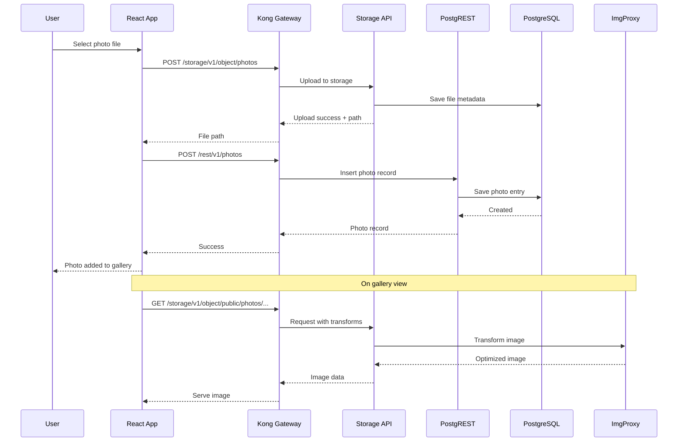
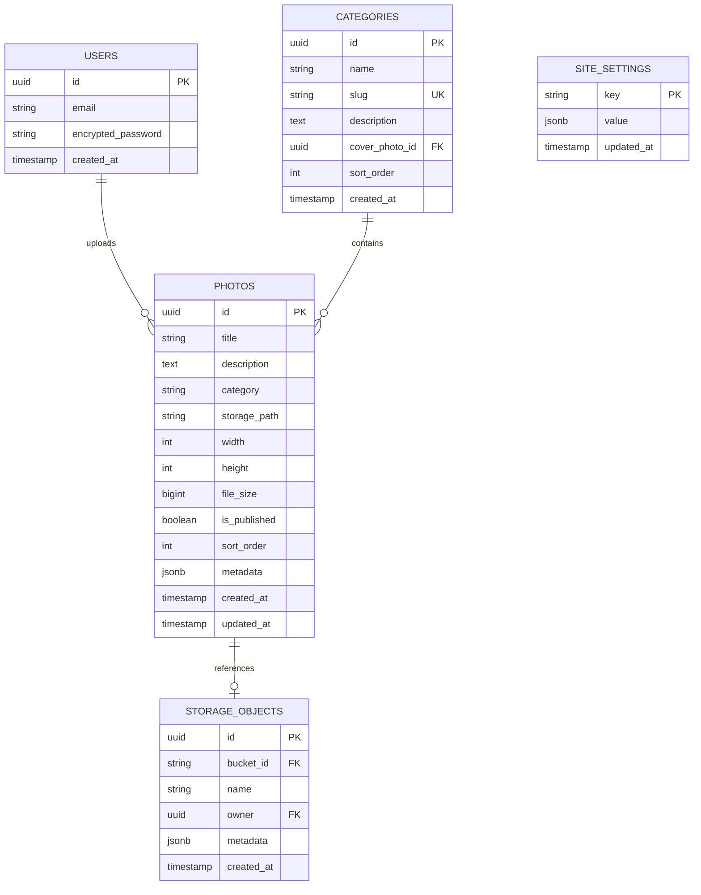

# HenrardVisuals - Architecture Documentation

## Overview

HenrardVisuals is a professional photography portfolio built with a modern, containerized architecture using **Docker**, **React/Vite/TypeScript**, and **self-hosted Supabase** for backend services.

---

## System Architecture



---

## Data Flow

### Authentication Flow



### Photo Upload Flow



---

## Container Configuration

| Container | Image | Port | Purpose |
|-----------|-------|------|---------|
| `henrard-app` | Custom (Vite) | 5173 | React frontend |
| `henrard-nginx` | nginx:alpine | 80, 443 | Reverse proxy |
| `henrard-db` | postgres:15-alpine | 5432 | PostgreSQL database |
| `henrard-kong` | kong:2.8 | 8000 | API Gateway |
| `henrard-auth` | supabase/gotrue | 9999 | Authentication |
| `henrard-rest` | postgrest/postgrest | 3000 | REST API |
| `henrard-storage` | supabase/storage-api | 5000 | File storage |
| `henrard-studio` | supabase/studio | 3000 | Admin UI |
| `henrard-meta` | supabase/postgres-meta | 8080 | DB metadata |
| `henrard-imgproxy` | darthsim/imgproxy | 8080 | Image processing |

---

## Database Schema



---

## Security Architecture

### Row Level Security (RLS)

All database tables have RLS enabled:

- **Public read**: Published photos, categories, settings
- **Authenticated write**: Full CRUD for authenticated users
- **Service role bypass**: For admin operations

### Authentication Flow

1. **JWT-based**: GoTrue issues JWTs with configurable expiry
2. **Session persistence**: Stored in localStorage
3. **Auto-refresh**: SDK handles token refresh automatically
4. **Role-based**: `anon`, `authenticated`, `service_role`

### Network Security

- **Isolated Docker network**: All services on `henrard-network`
- **Internal-only access**: Database not exposed externally
- **Rate limiting**: Kong enforces request limits
- **CORS configuration**: Strict origin policies

---

## Technology Decisions

### Why Self-Hosted Supabase?

1. **Data sovereignty**: Full control over photography data
2. **Cost efficiency**: No per-request pricing
3. **Customization**: Full access to PostgreSQL
4. **Privacy**: Client data stays on VPS

### Why React + Vite?

1. **Performance**: Fast HMR, optimized builds
2. **TypeScript**: Type safety throughout
3. **Ecosystem**: Rich component libraries
4. **Developer experience**: Modern tooling

### Why Masonry Layout?

1. **Visual appeal**: Asymmetric grids suit photography
2. **Flexibility**: Handles varying aspect ratios
3. **Performant**: CSS Grid-based implementation
4. **Responsive**: Adapts to screen sizes

---

## File Structure

```
/home/kyky/Tristan/
├── docker-compose.yml          # Container orchestration
├── Dockerfile                  # Multi-stage React build
├── nginx/
│   └── nginx.conf              # Reverse proxy config
├── volumes/
│   ├── db/                     # PostgreSQL persistence
│   │   └── init/init.sql       # Schema initialization
│   ├── kong/kong.yml           # API Gateway config
│   └── storage/                # Uploaded files
├── src/                        # React application
│   ├── components/             # UI components
│   ├── hooks/                  # Custom React hooks
│   ├── lib/                    # Supabase client
│   ├── pages/                  # Route pages
│   └── types/                  # TypeScript types
├── tests/                      # Test setup
│   └── mocks/                  # MSW handlers
└── docs/                       # Documentation
```
